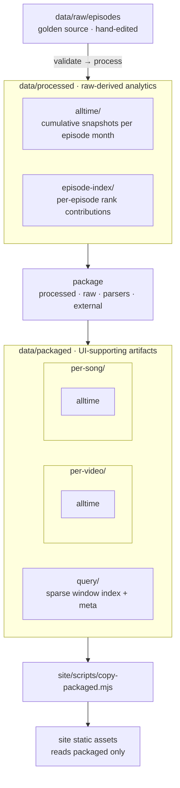

# Data

Implementation detail for [ADR-003](../docs/adr/adr-003-data-layers.md): paths, pipeline wiring, layer contracts, and example shapes. **Paths and field names here may change** — ADR-003 states principles only.

Related: [ADR-000](../docs/adr/adr-000-tech-stack.md), [AGENTS.md](../AGENTS.md), `[site/README.md](../site/README.md)`, `[commands.md](../docs/faq/commands.md)`

## Layout & pipeline




| Path                                        | Role                                                                              | Command                              | Produced by       | Consumed by                                              |
| ------------------------------------------- | --------------------------------------------------------------------------------- | ------------------------------------ | ----------------- | -------------------------------------------------------- |
| `raw/episodes/`                             | **Source of truth.** One JSON file per Top 20 episode. Edit by hand.              | `uv run evtop20 new-episode YYYY-MM` | Editors           | Pipeline                                                 |
| `processed/alltime/`                        | Generated stats (do not edit). Cumulative snapshots per episode month.            | `uv run evtop20 process`             | `evtop20 process` | `add` (alltime corpus), notebooks, **input to packaged** |
| `processed/episode-index/`                  | Per-episode Top 20 rank contributions (not cumulative). One file per episode month. | `uv run evtop20 process`             | `evtop20 process` | `package` (window query index)                           |
| `packaged/per-video/`, `packaged/per-song/` | UI-ready JSON (not hand-edited). `per-{video,song}/alltime/`.                     | `uv run evtop20 package`             | `evtop20 package` | Tools, reference; site uses `query/` for tables          |
| `packaged/query/`                           | Sparse window query index + static row metadata for flexible period ranges.       | `uv run evtop20 package`             | `evtop20 package` | Site (flexible range UI)                                 |
| `metadata/`                                 | Hand-maintained lookup tables (e.g. manual video metadata by `youtube_video_id`). | —                                    | Editors           | `package`                                                |
| `external/esc-results/`                     | Vendored ESC results join table (flattened from pinned [EurovisionAPI/dataset](https://github.com/EurovisionAPI/dataset) release). Not hand-edited. | — (flatten script TBD)               | Maintainers       | `package`                                                |
| `schemas/`                                  | JSON Schema for raw episode files.                                                | —                                    | Editors           | `validate`                                               |


**Regeneration:** raw change → validate → process → package.

**CI publish:** validate → process → package → `npm run build` (copy packaged → site static assets) → deploy.

---

## Raw episodes

Top 20 episodes are published monthly. YouTube titles follow:

`Eurovision Top 20: Most Watched – {Month} {Year}`

Example: `Eurovision Top 20: Most Watched – January 2026`

### Filename and period

Name episode files `YYYY-MM.json` (e.g. `2026-01.json`). The stem is the file id; `period` inside JSON is the canonical calendar month and must match the filename (`year`, `month`).

Always set `period.year` and `period.month` for the month the episode covers.

### Filling a raw episode

1. Open or copy a file in `raw/episodes/` (name it e.g. `2026-01.json`).
2. Set `episode_title` to the full YouTube title.
3. Set `period` (`year`, `month`) for the episode month.
4. Set `youtube_video_id` for the episode video (`""` until known).
5. Fill `video_title` for ranks 1–20 (exact video titles).
6. Set `youtube_video_id` on each ranked entry (`""` until known).

Schema: `schemas/episode.schema.json`.

---

## Processed layer

```text
data/processed/
  alltime/
    eurovision-top-20-alltime-YYYY-MM.json
    eurovision-top-20-alltime-latest.json
  episode-index/
    YYYY-MM.json
```

### Alltime snapshots

Cumulative stats: every episode with `period <=` snapshot month; one file per episode month plus `-latest` (no gap-month files).

**Row shape (video grain):** `video_title`, `top1` … `top20`, `chart_points`, `youtube_video_id` — ids not URLs. See `[chart_points.md](../docs/faq/chart_points.md)` for formula and tier meaning.

### Episode index

One file per raw episode month. Non-cumulative: only videos that appeared in that episode’s Top 20.

**File shape:**

```json
{
  "period": "2026-01",
  "rows": [
    { "rank": 3, "video_title": "…", "youtube_video_id": "…" }
  ]
}
```

Rows sorted by `video_title`. Ranks 1–20 only; empty slots omitted.


| Includes                                   | Does not include                       |
| ------------------------------------------ | -------------------------------------- |
| Tier counts, `chart_points`, canonical ids | Pre-built URLs                         |
|                                            | Song-level roll-ups                    |
|                                            | Parsed display labels, ESC final place |


`add` CLI: search corpus = latest processed alltime snapshot only. See `[commands.md](../docs/faq/commands.md)`.

---

## Packaged layer

May read **any source**: processed alltime, raw episodes, title parser (`title_parse/`), manual overrides (`data/metadata/`), external ESC datasets.

Layout: see diagram above. **Future (not shipped):** `insights/`, `charts/` under `packaged/`.


| Typical content                                               | Sources                                                                                                                                          |
| ------------------------------------------------------------- | ------------------------------------------------------------------------------------------------------------------------------------------------ |
| Augmented alltime video rows (watch URLs, parsed metadata, …) | processed alltime + title parser                                                                                                                 |
| Song stats                                                    | per-video rows + roll-up by case-insensitive `(artist, song)`; `[chart_points](../docs/faq/chart_points.md)` from summed tiers (`song_stats.py`) |
| Window query index (`query/`)                                 | `processed/episode-index/` + latest packaged video enrichment                                                                                    |
| Insight payloads (heatmaps, winner tables, …)                 | processed + raw + external                                                                                                                       |
| UI flags (e.g. fire-title filter)                             | parser + keyword lists (`[ui-filter-fire-titles.md](../docs/tasks/ui-filter-fire-titles.md)`)                                                    |
| Period index for scrubber                                     | `query/video-hits.json` `periods` array (via copy script → `periods-alltime.json`)                                                             |


**Shipped:** `per-video/alltime`, `per-song/alltime`, and `query/` (`video-hits`, `video-meta`, `song-hits`, `song-meta`). Flexible period range UI on `/` and `/songs/`. Insights/charts folders still future.

### Query index (`packaged/query/`)

Built from `processed/episode-index/` plus latest packaged video rows for enrichment metadata.

| File | Role |
| ---- | ---- |
| `video-hits.json` | Sparse hits per video: `{ periods, hits: [{ video_title, youtube_video_id, entries: [{ period, rank }] }] }` |
| `video-meta.json` | Window-independent display fields per video (from latest alltime enrichment) |
| `song-hits.json` | Sparse hits per song: entries `{ period, ranks: […] }` (member-video ranks per episode) |
| `song-meta.json` | Window-independent display fields per song |

Client aggregates a `[begin, end]` window from these files via `site/src/components/stats/queryWindow.ts` (golden-tested against pipeline).

Processed row shape remains unchanged. ESC final place is joined in `package` — [`esc_final_place.md`](../docs/faq/esc_final_place.md).

---

## External data (`external/`)

Third-party snapshots vendored in git for reproducible `package` runs — **no network fetch in CI**.

**ESC results:** `external/esc-results/` — `MANIFEST.json` (pinned EurovisionAPI release tag `2026.4`) + `entries.json` (1795 flat rows). Regenerate with `uv run evtop20 vendor-esc flatten`. `esc_final_place` on packaged rows comes from join in `package` (vendor + `metadata/esc-placement-overrides.json` + `metadata/esc-join-overrides.json`). Codes: numeric rank, `DNQ`, `DQ`, `CANCELLED`, `WITHDRAWN`, `PENDING`, `NON_ENTRY`, `null`. See [`esc_final_place.md`](../docs/faq/esc_final_place.md#placement-dictionary).

---

## Site contract

- Prebuild copies packaged JSON into static assets (`site/scripts/copy-packaged.mjs`).
- Islands read **packaged** data only. They may compute derived stats (tier counts, `chart_points`, window aggregation) from packaged payloads when a widget needs it—e.g. `queryWindow.ts` over `packaged/query/` (golden-tested against pipeline).
- Alltime table snapshots under `per-*/alltime/` remain packaged for reference/tools; the site table uses the query index.

---

## Open questions


| Topic                                           | Notes                          |
| ----------------------------------------------- | ------------------------------ |
| Packaged subfolder and file names               | Per-widget tasks define shapes |
| Eurovision World URL rule                       | TBD                            |
| `null` vs omit optional fields in packaged JSON | TBD                            |
| Typegen for packaged (site)                     | Hand-written TS in `site/src/` |


