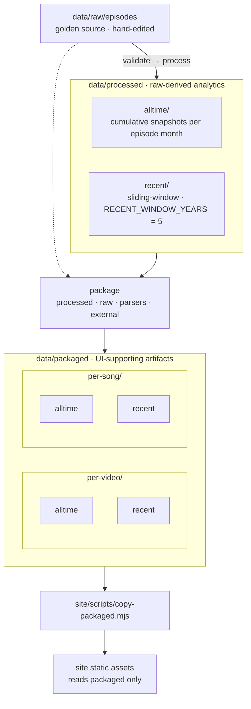

# Data

Implementation detail for [ADR-003](../docs/adr/adr-003-data-layers.md): paths, pipeline wiring, layer contracts, and example shapes. **Paths and field names here may change** — ADR-003 states principles only.

Related: [ADR-000](../docs/adr/adr-000-tech-stack.md), [AGENTS.md](../AGENTS.md), `[site/README.md](../site/README.md)`, `[commands.md](../docs/faq/commands.md)`

## Layout & pipeline




| Path                                        | Role                                                                              | Command                              | Produced by       | Consumed by                                              |
| ------------------------------------------- | --------------------------------------------------------------------------------- | ------------------------------------ | ----------------- | -------------------------------------------------------- |
| `raw/episodes/`                             | **Source of truth.** One JSON file per Top 20 episode. Edit by hand.              | `uv run evtop20 new-episode YYYY-MM` | Editors           | Pipeline                                                 |
| `processed/alltime/`, `processed/recent/`   | Generated stats (do not edit). Cumulative and sliding-window variants.            | `uv run evtop20 process`             | `evtop20 process` | `add` (alltime corpus), notebooks, **input to packaged** |
| `packaged/per-video/`, `packaged/per-song/` | UI-ready JSON (not hand-edited). `per-{video,song}/{alltime,recent}`.             | `uv run evtop20 package`             | `evtop20 package` | Astro / React islands only                               |
| `metadata/`                                 | Hand-maintained lookup tables (e.g. manual video metadata by `youtube_video_id`). | —                                    | Editors           | `package`                                                |
| `schemas/`                                  | JSON Schema for raw episode files.                                                | —                                    | Editors           | `validate`                                               |


**Regeneration:** raw change → validate → process → package.

**CI publish:** validate → process → package → `npm run build` (copy packaged → site static assets) → deploy.

---

## Raw episodes

Top 20 episodes are published monthly. YouTube titles follow:

`Eurovision Top 20: Most Watched – {Month} {Year}`

Example: `Eurovision Top 20: Most Watched – January 2026`

### Filename and period

Name episode files `**YYYY-MM.json`** (e.g. `2026-01.json`). The stem is the file id; `**period`** inside JSON is the canonical calendar month and must match the filename (`year`, `month`).

Always set `period.year` and `period.month` for the month the episode covers.

### Filling a raw episode

1. Open or copy a file in `raw/episodes/` (name it e.g. `2026-01.json`).
2. Set `episode_title` to the full YouTube title.
3. Set `period` (`year`, `month`) for the episode month.
4. Set `youtube_video_id` for the episode video (`""` until known).
5. Fill `video_title` for ranks 1–20 (exact video titles).
6. Set `youtube_video_id` on each ranked entry (`""` until known).

Schema: `schemas/episode.schema.json`.

---

## Processed layer

Two sibling folders; **variant is in the basename** (`alltime` vs `recent`):

```text
data/processed/
  alltime/
    eurovision-top-20-alltime-YYYY-MM.json
    eurovision-top-20-alltime-latest.json
  recent/
    eurovision-top-20-recent-YYYY-MM.json
    eurovision-top-20-recent-latest.json
```


| Variant     | Episode inclusion                                                                                                         |
| ----------- | ------------------------------------------------------------------------------------------------------------------------- |
| **alltime** | Cumulative: every episode with `period <=` snapshot month; one file per episode month plus `-latest` (no gap-month files) |
| **recent**  | Sliding 5-year calendar window anchored at snapshot month (`aggregate.py`)                                                |


**Row shape (video grain):** `video_title`, `top1` … `top20`, `chart_points`, `youtube_video_id` — ids not URLs. See `[chart_points.md](../docs/faq/chart_points.md)` for formula and tier meaning.


| Includes                                       | Does not include                       |
| ---------------------------------------------- | -------------------------------------- |
| Tier counts, `chart_points`, canonical ids     | Pre-built URLs                         |
| Optional `window` metadata on recent snapshots | Song-level roll-ups                    |
|                                                | Parsed display labels, ESC final place |


`**add` CLI:** search corpus = latest processed alltime snapshot only. See `[commands.md](../docs/faq/commands.md)`.

---

## Packaged layer

May read **any source**: processed (alltime and/or recent), raw episodes, title parser (`title_parse/`), manual overrides (`data/metadata/`), external ESC datasets.

Layout: see diagram above. **Future (not shipped):** `insights/`, `charts/` under `packaged/`.


| Typical content                                               | Sources                                                                                                                                          |
| ------------------------------------------------------------- | ------------------------------------------------------------------------------------------------------------------------------------------------ |
| Augmented alltime video rows (watch URLs, parsed metadata, …) | processed alltime + title parser                                                                                                                 |
| Song stats                                                    | per-video rows + roll-up by case-insensitive `(artist, song)`; `[chart_points](../docs/faq/chart_points.md)` from summed tiers (`song_stats.py`) |
| Insight payloads (heatmaps, winner tables, …)                 | processed + raw + external                                                                                                                       |
| UI flags (e.g. fire-title filter)                             | parser + keyword lists (`[ui-filter-fire-titles.md](../docs/tasks/ui-filter-fire-titles.md)`)                                                    |
| Period index for scrubber                                     | `periods-alltime.json` at site build                                                                                                             |


**Shipped:** all four `per-video` / `per-song` × `alltime` / `recent` table snapshots. Insights/charts folders still future.

Processed row shape remains unchanged when packaged ships. External joins (e.g. ESC final place) land in packaged only — `[eurovision-final-place.md](../docs/tasks/eurovision-final-place.md)`.

---

## Site contract

- Prebuild copies packaged JSON into static assets (`site/scripts/copy-packaged.mjs`).
- Islands fetch packaged snapshots per grain and period (`[site/README.md](../site/README.md)`).
- No id→URL, title→parse, tier math, or song roll-up in the browser.

---

## Open questions


| Topic                                           | Notes                          |
| ----------------------------------------------- | ------------------------------ |
| Packaged subfolder and file names               | Per-widget tasks define shapes |
| Eurovision World URL rule                       | TBD                            |
| `null` vs omit optional fields in packaged JSON | TBD                            |
| Typegen for packaged (site)                     | Hand-written TS in `site/src/` |


