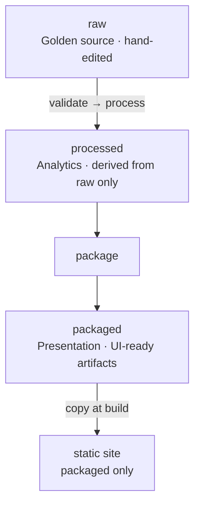

# ADR-003: Data layers

- **Status:** Accepted
- **Date:** 2026-06-13
- **Related:** [ADR-000](adr-000-tech-stack.md), [ADR-002](adr-002-site-visualization.md), [`data/README.md`](../../data/README.md), [AGENTS.md](../../AGENTS.md)

## Context

Eurovision Top 20 data moves through three **production stages**, each with a distinct contract. Paths, filenames, and row shapes are **not fixed here** — they live in [`data/README.md`](../../data/README.md) and evolve with implementation.

**Project rule:** design the **data model before UI**; ship sample artifacts before React islands ([AGENTS.md](../../AGENTS.md)).

## Decision

### Three-layer model

| Layer | Role | Produced by | Consumed by |
|-------|------|-------------|-------------|
| **raw** | Authoritative episode rankings | Editors | Pipeline |
| **processed** | Machine-oriented analytics exports | `process` | Tools, automation, `package` |
| **packaged** | UI-supporting JSON (enrichment, roll-ups, insight payloads) | `package` | Static site only |

**Regeneration:** raw change → `validate` → `process` → `package`. Never hand-edit `processed` or `packaged`. Processed artifacts remain useful without rebuilding packaged. The site **must not** read processed once packaged exists.

### Layer boundaries

| | **processed** | **packaged** |
|---|---------------|--------------|
| **Inputs** | Raw episodes only | Any: processed, raw, parsers, manual overrides, external datasets |
| **Purpose** | Portable stats, git-diffable exports | UI-facing JSON; may be sparse (query index) or row-ready (tables) |
| **Transforms** | Tier aggregation, canonical ids | URL building, title parsing, song roll-ups, external joins, UI flags |
| **Site** | Not read by the site | Sole data source for the site |

Processed may include multiple **stat variants** (e.g. cumulative vs sliding window). Packaged layout is a **tree of JSON files** grouped by UI area — schemas evolve per widget.

### Pipeline commands

| Step | Command | Writes |
|------|---------|--------|
| Validate | `evtop20 validate` | Normalized raw |
| Process | `evtop20 process` | Processed (alltime snapshots + episode-index) |
| Package | `evtop20 package` | Packaged (alltime tables + `query/` window index) |

`process` must not write packaged output. `package` must not re-implement tier aggregation — reuse processed rows or shared library code also used by `process`.

**Site contract:** the site reads **packaged** data only (not processed or raw). Islands may compute derived fields on packaged payloads—window aggregation, tier counts, `chart_points`, sort/filter UI state. When client math mirrors pipeline semantics, cover it with tests against the pipeline reference ([`data/README.md`](../../data/README.md)).

### Versioning

- **processed:** stable tool interchange; breaking changes acceptable pre-publish.
- **packaged:** site-internal; may change with UI. Optional schema version per file when shapes stabilize.

## Alternatives considered

| Alternative | Why not |
|-------------|---------|
| Flat processed layout | No room for sibling stat variants |
| Heavier rename (`derived` / `publish`) | Unnecessary for current scale |
| Song roll-ups in processed | Needs parser and presentation rules; belongs in packaged |
| Site reads processed or raw | Breaks layer boundary; site uses packaged only |
| One monolithic JSON per widget | Prefer grouped files under packaged |
| Precompute every query in packaged | Flexible ranges need client aggregation over sparse index at current scale |

## Consequences

### Positive

- **raw → processed → packaged** matches a clear production mental model
- Processed stays clean for CLI tools and exports
- Enrichment and roll-ups live where presentation belongs
- Multiple processed variants can coexist without polluting packaged

### Negative / trade-offs

- Third pipeline step; packaged can lag until `package` runs
- Packaged internal layout is still evolving per widget

### Follow-up

- Concrete paths, row shapes, and CI wiring: [`data/README.md`](../../data/README.md)
- Site consumption: [`site/README.md`](../../site/README.md)
- Song roll-up: shipped in `package` / `song_stats.py`
- Sliding-window processed variant: shipped in `aggregate.py`
