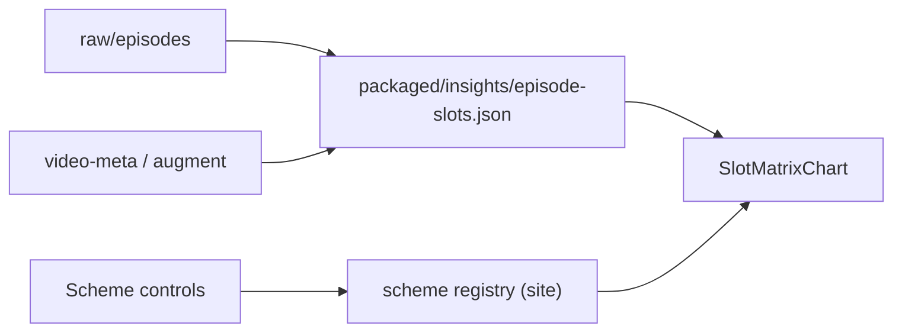

# insight-episode-slot-schemes (epic)

**Episode slot matrix** — reuse the year-composition ●/row UI as a **scheme-driven** insight: each row = one Top 20 episode (20 nominal slots); controls switch **color scheme**, **Group** (in-row facet grouping), and optional **chart rank order**.

Parent: shipped [`insight-year-composition-tooltips`](insight-year-composition-tooltips.md) (year scheme PoC on `/insights/year-composition/`)  
Depends on: `data/raw/episodes/`, `package` title parse + ESC join + `fire.json`, [`site-theming.md`](site-theming.md)  
Related: removed [`insight-country-composition-bars.md`](insight-country-composition-bars.md), [`insight-presence-heatmap.md`](insight-presence-heatmap.md), stats [`FilterBar`](../site/src/components/stats/filters/FilterBar.tsx) / [`defs.ts`](../site/src/components/stats/filters/defs.ts), [ADR-003](../adr/adr-003-data-layers.md), [ADR-002](../adr/adr-002-site-visualization.md)

**Status:** Backlog (epic)

---

## Problem

The year-composition chart proves the **slot-row metaphor** (20 bubbles × episode timeline). That implementation is **hard-wired to one dimension** (contest year): packaged aggregates (`segments[]`), year color map, year-based grouping, bespoke page.

We want the **same visual grammar** for other per-slot questions:

| Scheme | Color / glyph | Group on (default) |
|--------|----------------|---------------------|
| **Year** (PoC ✓) | Color by contest year | Same year adjacent; newest year leftmost |
| **ESC winners** | Winner = red; others gray | Winners together first |
| **Country** | Color per country | Same country adjacent; country name ASC |
| **Fire** | Fire emoji for allowlisted clips; gray ● otherwise | Fire slots together first |

With **Group** off, use **chart order**: left-to-right = rank 1…20 (actual Top 20 order, no facet grouping).

Stats tables already expose similar dimensions via **filters** (country, year, ESC, fire). Insights need **encoding** (color/glyph + row-internal layout), not row filtering — but the **control affordance** can mirror the filter bar (toggle / segmented scheme picker).

---

## Goal (epic)

One **flexible slot-matrix insight** (route TBD — evolve `/insights/year-composition/` or new `/insights/episode-slots/`):

- **Rows:** episode months, oldest → newest (same as today).
- **Columns:** 20 nominal slots per row (`slot_capacity`).
- **Scheme selector:** switches active **color scheme** (and default Group layout).
- **Group** toggle: when on, slots with the same facet value appear **adjacent** (visual grouping); when off, **chart order** (rank 1…20 left-to-right).
- **Per-slot tooltips:** episode period + slot detail (reuse [`slotTooltipLabel`](../../site/src/components/insights/episodeComposition.ts) patterns).
- **Extensibility:** add/remove schemes via a small registry — no fork per scheme page.

**PoC already shipped:** “Year color scheme” on `/insights/year-composition/` — treat as first scheme plugin after refactor, not a parallel implementation.

### Group vs chart order

| Control | User-facing name | Effect |
|---------|------------------|--------|
| **Group** (on) | `Group` | Slots sharing the active scheme’s facet value sit **next to each other** (e.g. all 2024 ● together). Reads as grouping, not “sorting”. |
| **Group** (off) | *(implicit — chart order)* | Slots follow **episode rank** 1 → 20 left-to-right. No facet grouping. |

**Implementation note:** Group is **not** a separate layout engine — it is **sorting** slots within the row by a scheme-defined key (then stable tie-break). The UI label is **Group** because the user goal is visual **clustering by facet**, not reordering for its own sake. Document sort keys per scheme in the registry; do not expose “sort direction” as primary UI unless a scheme needs an override later.

---

## What we can reuse today

| Asset | Grain | Metadata | Fit |
|-------|--------|----------|-----|
| `data/raw/episodes/*.json` | 20 ranks + `video_title` | None inline | **Source of truth** for rank + title per episode |
| `data/processed/episode-index/` | rank + title + id | None | Cross-check; sorted by title, not rank |
| `packaged/query/video-meta.json` | per `video_title` | `year`, `country`, `esc_final_place`, `fire`, … | **Join target** for slot enrichment |
| `packaged/query/video-hits.json` | sparse period+rank | via meta join | Reconstruct episode membership; heavier client join |
| `packaged/insights/episode-year-composition.json` v2 | aggregated segments + `titles[]` | year only | **Scheme-specific** — replace with generic slots artifact |
| `data/metadata/year-colors.json` | year → hex | Year scheme colors | ✓ exists |
| `data/metadata/country-colors.json` | — | **Removed** with country composition | Country scheme needs **revival** (see cancelled bars task) |
| `data/metadata/fire.json` | id allowlist | Fire scheme | ✓ exists |
| Stats `esc` filter helpers | `esc_final_place === 1` | Winners scheme | Reuse **rules**, not filter UI |

**Gap:** no single packaged **per-episode, per-rank slot record** with joined metadata. Year composition rebuilds a partial view in `insights_composition.py`; other schemes would duplicate walks or client joins.

**Recommendation:** new packaged **`episode-slots`** (name TBD) — one pipeline pass, all schemes read the same rows.

---

## Target architecture (sketch)



### Packaged slot row (spike output)

Design-first. Illustrative shape — field names/order finalized in spike:

```json
{
  "version": 1,
  "periods": ["2016-09", "…"],
  "slot_capacity": 20,
  "episodes": [
    {
      "missing": 10,
      "period": "2016-09",
      "slots": [
        {
          "rank": 1,
          "video_title": "…",
          "youtube_video_id": "…",
          "country": "Sweden",
          "esc_final_place": 1,
          "fire": false,
          "year": 2009
        },
        {
          "missing": true,
          "rank": 11
        }
      ]
    }
  ]
}
```

| Principle | Note |
|-----------|------|
| **Fixed 20 slots** | Missing ranks explicit (`missing: true`) or pad to 20 — pick one in spike |
| **Alphabetical object keys** | Per AGENTS.md unless semantic order |
| **Join in pipeline** | Same `augment_stats_row` / meta lookup as `package`; site does not parse titles |
| **Derived fields optional** | e.g. `is_esc_winner: bool` precomputed vs site reads `esc_final_place === 1` |

### Scheme plugin (site)

Each scheme registers:

| Hook | Purpose |
|------|---------|
| `id`, `label` | UI + URL param |
| `slotColor(slot)` / `slotGlyph(slot)` | Visual encoding |
| `groupSortKey(slot)` | Sort key when **Group** is on — clusters equal keys adjacently |
| `legend()` | Swatches / labels |
| `defaultGroupSort` | `asc` \| `desc` + key (implementation detail; not primary UI) |

**Chart order (Group off):** sort key = `rank` always; colors/glyphs still from active scheme (or muted — open question).

### UI controls

Mirror stats filter bar **layout**, different semantics:

- **Scheme** — segmented control or select (Year \| ESC winners \| Country \| Fire).
- **Group** — toggle (default **on** per scheme). On: facet clustering via in-row sort. Off: chart rank order. Label is **Group**, not “Sort”.
- **URL persist?** — follow [`ui-sort-url-persist`](ui-sort-url-persist.md) / filter URL patterns if insights subpage should be shareable (spike). Param name e.g. `group=1` \| `group=0`, not `sort=`.

---

## Planned schemes (post-foundation)

| Scheme | Color / glyph | Group on (sort key) | Notes |
|--------|---------------|---------------------|-------|
| `year` | `year-colors.json` | Year desc (newest left) | Migrate PoC |
| `esc-winner` | Red if `esc_final_place === 1`, else `--chart-missing` | Winners first | Gray = non-winner + unknown placement |
| `country` | `country-colors.json` | `country` ASC | Regenerate metadata file; many hues |
| `fire` | `🔥` if `fire`, else gray ● | Fire first | Glyph not color; access/a11y note |

Future schemes (out of epic scope): `performance_category`, `esc_final_place` bands, song grain, etc.

---

## Suggested task split

Work **top-down**: data model spike → foundation → one new scheme → UI chrome → remaining schemes.

| ID | Type | Goal |
|----|------|------|
| **`insight-episode-slots-data`** | Spike + pipeline | Design `episode-slots.json`; builder from raw + meta; sample in repo; tests |
| **`insight-slot-matrix-foundation`** | Refactor | `SlotMatrixChart` + scheme interface; migrate year page to registry; deprecate year-only composition JSON path |
| **`insight-slot-scheme-ui`** | UI | Scheme picker, **Group** toggle, wire to chart |
| **`insight-scheme-esc-winners`** | Scheme | Winner coloring + group key |
| **`insight-scheme-country`** | Scheme + metadata | Restore `country-colors.json` + generator script; country scheme |
| **`insight-scheme-fire`** | Scheme | Fire glyph + group key |
| **`insight-year-composition-cleanup`** | Cleanup | Remove redundant `episode-year-composition.json` if fully superseded; docs/RELEASE |

Optional parallel spikes (time-boxed):

- **Client join feasibility** — `video-hits` + `video-meta` per period in browser vs single packaged file (size/latency).
- **URL state** — `?scheme=year&group=1` vs session-only for v1.

---

## Migration notes (year PoC)

| Today | Epic direction |
|-------|----------------|
| `episode-year-composition.json` v2 | Superseded by `episode-slots.json` + year scheme runtime grouping **or** keep pre-aggregated segments as optimization (likely **not** — prefer one slot list) |
| `EpisodeCompositionChart` | Generalize to `SlotMatrixChart` |
| `yearEpisodesAsComposition` / `buildBarSegments` | Replace with `slots → rendered cells` per scheme + Group on/off |
| Per-slot tooltips | Keep; slot record carries `video_title` |
| Calendar-year row labels | Orthogonal to scheme — keep `yearLabelBeforeEpisode` on episode `period` |

---

## Done when (epic)

- [ ] Packaged per-episode slot list with joined metadata documented and emitted
- [ ] Chart component scheme-agnostic; year scheme parity with current PoC
- [ ] Scheme UI (picker + **Group** toggle) live
- [ ] At least **two** non-year schemes shipped (pick: ESC winners + fire or country)
- [ ] Adding a scheme does not require chart fork — registry + tests only
- [ ] Removing a scheme: delete registry entry + metadata; no dead JSON consumers
- [ ] Pipeline + site tests green; `npm run build` green
- [ ] `site/README.md` + `data/README.md` updated

---

## Out of scope (epic)

- Song-grain slot matrix
- Filtering **which episodes** appear (always full timeline v1)
- Heatmap / matrix views ([`insight-presence-heatmap`](insight-presence-heatmap.md))
- Side-by-side multiple schemes
- Animated transitions between schemes

---

## Open questions

1. **Route:** keep `/insights/year-composition/` and generalize in place, or new `/insights/episode-slots/` with year as default scheme?
2. **Missing slots in packaged data:** explicit 20-length array with `missing: true` entries vs sparse filled-only + pad in site?
3. **Group off + scheme:** keep scheme colors on rank-ordered slots, or neutral rank view?
4. **Country colors:** regenerate `country-colors.json` from old script, or new palette strategy (see cancelled bars task)?
5. **Fire glyph:** replace ● entirely for fire slots, or overlay? Screen-reader / tooltip text?
6. **ESC winners:** is `esc_final_place === 1` sufficient, or include “Winner of Eurovision” title heuristic for `null` placements?
7. **Unknown metadata:** same `Missing` treatment as year chart for all schemes?
8. **URL persistence** for scheme + Group on/off — required for v1 or follow-up?
9. **Payload size:** full metadata per slot × 114 episodes × 20 — acceptable vs slim slot + meta lookup by id?
10. **Pre-aggregation:** any scheme need cached segment counts (like today’s year JSON), or always compute groups client-side from 20 slots?
